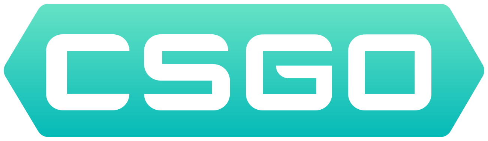
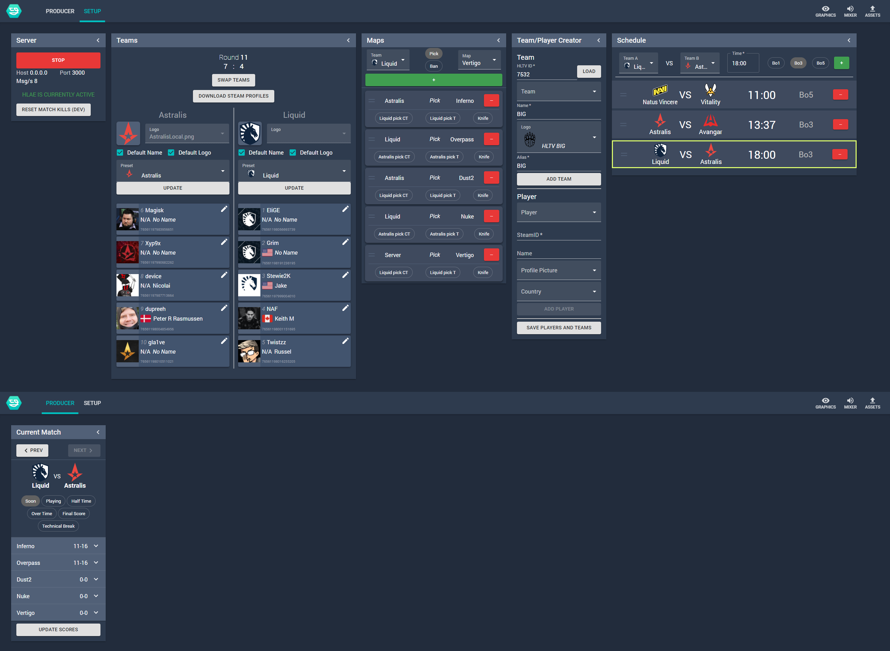

<!-- ReadMe template from https://github.com/othneildrew/Best-README-Template -->
<p align="center">
  <a href="https://github.com/EwanLyon/nodecg-csgo-manager">
    
  </a>

  <h3 align="center">NodeCG CSGO Manager</h3>

  <p align="center">
    
    
  </p>
</p>

<!-- TABLE OF CONTENTS -->
<details open="open">
  <summary><h2 style="display: inline-block">Table of Contents</h2></summary>
  <ol>
    <li>
      <a href="#about-the-project">About The Project</a>
      <ul>
        <li><a href="#built-with">Built With</a></li>
      </ul>
    </li>
    <li>
      <a href="#getting-started">Getting Started</a>
      <ul>
        <li><a href="#prerequisites">Prerequisites</a></li>
        <li><a href="#installation">Installation</a></li>
      </ul>
    </li>
    <li><a href="#usage">Usage</a></li>
    <li><a href="#roadmap">Roadmap</a></li>
    <li><a href="#contributing">Contributing</a></li>
    <li><a href="#license">License</a></li>
    <li><a href="#contact">Contact</a></li>
  </ol>
</details>

# NodeCG CSGO Manager
<!-- ABOUT THE PROJECT -->
## About The Project



A way to connect to the CSGO Game State Integration using NodeCG. This bundle not only includes the CSGO GSI information but also has tools for creating teams and player profiles while also managing tournaments. This uses NodeCG which is a browser based broadcast graphics manager.

This manager is still in its early stages and needs a lot of clean up and more features to properly work in a tournament. However it does currently work for single matches.

If you use this you may see dev messages in the console log as this is pre v1.

### Built With

* [NodeCG](https://www.nodecg.dev/)
* [TypeScript](https://www.typescriptlang.org/)
* [React](https://reactjs.org/)
* [Styled Components](https://styled-components.com/)

<!-- GETTING STARTED -->
## Getting Started

To get a local copy up and running follow these simple steps.

### Prerequisites

* [NodeCG](https://www.nodecg.dev/docs/installing)
* CSGO Game State Integration file

### Installation

A method to download and place in NodeCG is being looked into.

#### Building

1. Clone the repo into the NodeCG bundles folder

   ```sh
   cd nodecg/bundles
   git clone https://github.com/EwanLyon/nodecg-csgo-manager.git
   ```

2. Install NPM packages

   ```sh
   npm install
   ```

3. Run build

   ```sh
   npm run build
   ```

4. Start NodeCG

   ```sh
   npm run start
   ```

   or

   ```sh
   cd ../..
   node .
   ```

<!-- USAGE EXAMPLES -->
## Usage

A bundle using this is in the works at the moment and will be out shortly.

<!-- ROADMAP -->
## Roadmap

Currently a lot of code cleanup needs to occur. Expect changes to occur rapidly and break bundles using this.

See the [open issues](https://github.com/EwanLyon/nodecg-csgo-manager/issues) for a list of proposed features (and known issues).

<!-- CONTRIBUTING -->
## Contributing

Contributions are what make the open source community such an amazing place to be learn, inspire, and create. Any contributions you make are **greatly appreciated**.

1. Fork the Project
2. Create your Feature Branch (`git checkout -b feature/AmazingFeature`)
3. Commit your Changes (`git commit -m 'Add some AmazingFeature'`)
4. Push to the Branch (`git push origin feature/AmazingFeature`)
5. Open a Pull Request

<!-- LICENSE -->
## License

Distributed under the GNU General Public License v3.0 License. See `LICENSE` for more information.

<!-- CONTACT -->
## Contact

Ewan Lyon - [@Clubwhom](https://twitter.com/clubwhom)

Project Link: [https://github.com/ewanlyon/nodecg-csgo-manager](https://github.com/ewanlyon/nodecg-csgo-manager)
